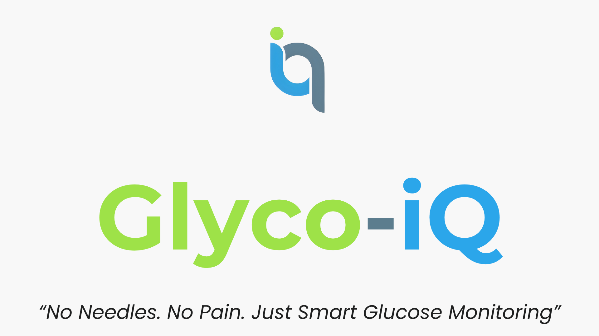
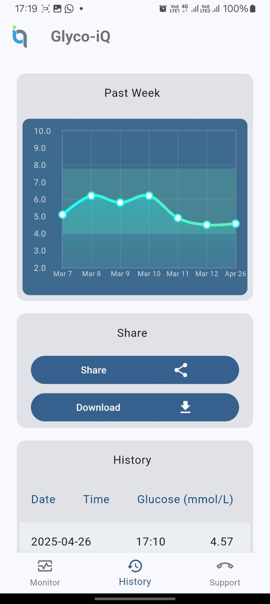

# GlycoIQ - Smart Non-Invasive Glucometer

<!-- Placeholder for GlycoIQ Logo -->



## Overview

GlycoIQ is a smart, non-invasive glucometer designed to predict blood glucose levels (in mmol/L) using image-based machine learning techniques. The system captures images with a Raspberry Pi Camera Module, utilizing a 650 nm red laser controlled via a companion mobile app. The trained Artificial Neural Network (ANN) model, converted to TensorFlow Lite (`ann_model.tflite`), processes these images on a Raspberry Pi 4B (prototype stage) and transmits the predicted glucose levels to the mobile app via Bluetooth. The final product is projected to use a Raspberry Pi Pico 2W for a compact design. This is an experimental prototype for non-invasive glucose monitoring and is not a medical-grade device.

**Note**: This is an experimental product for research purposes only. It is not FDA-approved or intended for medical diagnosis.

## Project Structure

- **README.md**: This file.
- **App_Screenshots/**: Contains app interface screenshots.
  - `Dashboard.jpeg`: Dashboard view.
  - `Landing Page.jpeg`: Landing page view.
  - `Slash Screen.jpeg`: Splash screen view.
- **Documentation/**: Includes project documentation and reference materials.
  - **Reference Papers/**:
    - `applsci-09-03046-with-cover.pdf`
    - `Non-Invasive_Blood_Glucose_Monitoring_Technology_A.pdf`
  - `Glyco-iQ Brochure.pdf`: Project brochure.
  - `Glyco-iQ.pdf`: Project overview or detailed document.
- **Product Design/**: Contains design-related documents or specifications.
- **Raspi Implementation/**: Contains the model and scripts for Raspberry Pi 4B deployment.
  - **Bluetooth_server/**:
    - `ble_server.py`: Bluetooth server script.
    - `device_control.py`: Script for device control.
    - `main.py`: Main execution script.
  - **model/**:
    - `ann_model.tflite`: Saved ANN model for inference (TensorFlow Lite).
    - `trained_simplified_cnn_glucose.h5`: Saved CNN model (optional).
    - `trained_simplified_cnn_glucose.tflite`: TensorFlow Lite version of the CNN model (optional).
  - `inspect_model_structure.py`: Script to view model structures.
  - `requirements.txt`: Python dependencies.

## App Screenshots

Here are some screenshots of the GlycoIQ mobile app interface:

<table>
  <tr>
    <td align="center">
      
      <br><i>Dashboard view showing glucose readings.</i>
    </td>
    <td align="center">
      
      <br><i>Landing page of the app.</i>
    </td>
    <td align="center">
      
      <br><i>Splash screen displayed on app launch.</i>
    </td>
  </tr>
</table>

## Device Pictures

<!-- Placeholder for Device Pictures -->
  
*Front view of the GlycoIQ device.*

  
*Side view of the GlycoIQ device.*

## Requirements

### Raspberry Pi 4B (Prototype Stage)
- Raspberry Pi 4B with Raspberry Pi OS (latest version recommended)
- Raspberry Pi Camera Module v2 connected to the PCIe slot
- 650 nm red laser module connected to relevant GPIO pins
- Python 3.7+
- Libraries listed in `requirements.txt` (includes `tensorflow` for TFLite inference, `opencv-python` for image processing, etc.)
- Install dependencies:
  ```bash
  pip install -r Raspi\ Implementation/requirements.txt
  ```

### Future Product (Raspberry Pi Pico 2W)
- Raspberry Pi Pico 2W (projected for final design)
- Compatible camera and laser modules (TBD)

### Mobile Device
- Android device (Flutter app support)
- Bluetooth enabled
- GlycoIQ mobile app installed

## Setup on Raspberry Pi 4B (Prototype Stage)

### Prepare the Raspberry Pi

1. Install Raspberry Pi OS on the Raspberry Pi 4B using the Raspberry Pi Imager.
2. Boot the Raspberry Pi and connect it to a monitor, keyboard, and mouse (or use SSH for headless setup).
3. Update the system:
   ```bash
   sudo apt update && sudo apt upgrade -y
   ```
4. Enable the camera:
   ```bash
   sudo raspi-config
   ```
   Navigate to Interface Options → Camera → Enable → Finish → Reboot.
5. Install Python and pip:
   ```bash
   sudo apt install python3 python3-pip -y
   ```

### Connect Hardware

1. Connect the Raspberry Pi Camera Module v2 to the PCIe slot.
2. Connect the 650 nm red laser module to the relevant GPIO pins (refer to device_control.py for pin configuration).
3. Test the camera:
   ```bash
   raspistill -o test.jpg
   ```
4. Test the laser (via app or script, TBD).

### Transfer Project Files

1. Copy the Raspi Implementation/ folder to the Raspberry Pi:
   ```bash
   scp -r Raspi\ Implementation/ pi@<raspberry-pi-ip>:/home/pi/GlycoIQ/
   ```
2. Ensure the model file (ann_model.tflite) is in Raspi Implementation/model/.

### Install Dependencies

Install required Python libraries from requirements.txt:
```bash
pip install -r /home/pi/GlycoIQ/Raspi\ Implementation/requirements.txt
```

### Set Up Bluetooth Server

1. Navigate to Raspi Implementation/Bluetooth_server/.
2. Pair the Raspberry Pi with your mobile device:
   - On the Raspberry Pi, enable Bluetooth:
     ```bash
     sudo bluetoothctl
     power on
     discoverable on
     pairable on
     ```
   - On your mobile device, search for the Raspberry Pi and pair.
3. Start the Bluetooth server:
   ```bash
   cd /home/pi/GlycoIQ/Raspi\ Implementation/Bluetooth_server/
   python ble_server.py
   ```

## Using the Product

### Step 1: Power On the Device
- Connect the Raspberry Pi 4B to a power source.
- Ensure the camera module and laser are properly connected.

### Step 2: Capture an Image and Measure Glucose
- Open the GlycoIQ mobile app on your Android device.
- Position your finger or target area in front of the camera module.
- Use the app to activate the 650 nm red laser and capture an image.
- The app sends a command to the Raspberry Pi, which processes the image using the ANN model (ann_model.tflite) and transmits the predicted glucose level back to the app via Bluetooth.

### Step 3: View Results on the Mobile App
- The predicted glucose level will be displayed on the app's dashboard.
- Use the app to view historical readings and trends (if supported).
- Adjust laser settings or recapture if needed via the app.

## Safety Guidelines
- Ensure the camera lens and laser are clean and unobstructed.
- Use in a well-lit environment to improve image quality.
- Avoid direct eye exposure to the laser.
- This device is experimental and not a substitute for medical-grade glucometers. Consult a healthcare professional for accurate diagnosis.

## Mobile App

The GlycoIQ mobile app, built with Flutter, provides a user-friendly interface to control the device and view glucose readings. Features include:

- Activation and control of the 650 nm red laser
- Real-time glucose level display
- Historical data tracking
- Alerts for abnormal readings (if implemented)

**Supported Platforms**: Android (iOS support forthcoming)  
**Download**: Install from the app repository or build from source  
**Source Code**: Available at https://github.com/NilaknaW/Glyco-iQ-App

### Setup:
1. Install the app on your Android device.
2. Enable Bluetooth and pair with the Raspberry Pi 4B.
3. Launch the app and connect to the Raspberry Pi to start using the glucometer.

## Troubleshooting

### Bluetooth Connection Fails:
- Ensure Bluetooth is enabled on both the Raspberry Pi and mobile device.
- Re-pair the devices:
  ```bash
  sudo bluetoothctl
  remove <device-mac-address>
  scan on
  pair <device-mac-address>
  ```
- Restart ble_server.py.

### Image Capture Errors:
- Verify the camera module is enabled (raspi-config) and connected to the PCIe slot.
- Test the camera:
  ```bash
  raspistill -o test.jpg
  ```

### Laser Control Issues:
- Ensure the laser is connected to the correct GPIO pins (see device_control.py).
- Test laser activation via the app or manually:
  ```bash
  python Raspi\ Implementation/device_control.py
  ```

### Inaccurate Readings:
- Ensure proper lighting and finger positioning.
- The model is experimental, so accuracy may vary.

### Raspberry Pi Performance:
- If inference is slow, ensure TensorFlow Lite is optimized for the Raspberry Pi.
- Reboot the Raspberry Pi:
  ```bash
  sudo reboot
  ```

## Models

### Artificial Neural Network (ANN)
**File**: Raspi Implementation/model/ann_model.tflite  
**Structure**:
- Input: 256 features (normalized blue channel histogram bins)
- Architecture:
  - First Hidden Layer: Dense (1024 units, ReLU activation)
  - Dropout: 0.2
  - Second Hidden Layer: Dense (1024 units, ReLU activation)
  - Dropout: 0.2
  - Output Layer: Dense (1 unit, no activation for regression)
- Output: Single glucose level (mmol/L)

**Pros**: Captures complex patterns in histogram features, lightweight in TFLite format  
**Cons**: Experimental accuracy, requires preprocessing (blue channel histogram)

### Simplified CNN (Optional)
**File**: Raspi Implementation/model/trained_simplified_cnn_glucose.h5, Raspi Implementation/model/trained_simplified_cnn_glucose.tflite  
**Structure**:
- Input: 224x224x3 images, normalized to [0, 1]
- Layers: 2 Conv2D, BatchNorm, MaxPooling, Dense, Dropout
- Output: Single glucose level (mmol/L)

**Pros**: Captures spatial features directly from images  
**Cons**: Resource-intensive; use .tflite for better performance on Raspberry Pi

## Future Improvements

### Enhance Image Processing:
- Add preprocessing to improve image quality (e.g., contrast adjustment)

### Mobile App Features:
- Add notifications, data export, or health platform integration

### Hardware Transition:
- Finalize design with Raspberry Pi Pico 2W
- Integrate dedicated sensors for enhanced accuracy

## License
This project is licensed under the MIT License. See LICENSE for details.

## By
<!-- Placeholder for Team Logo -->

Team Synop

## Contact
For questions or support, contact [yehenasuramuni@hotmail.com] or open an issue on GitHub.
